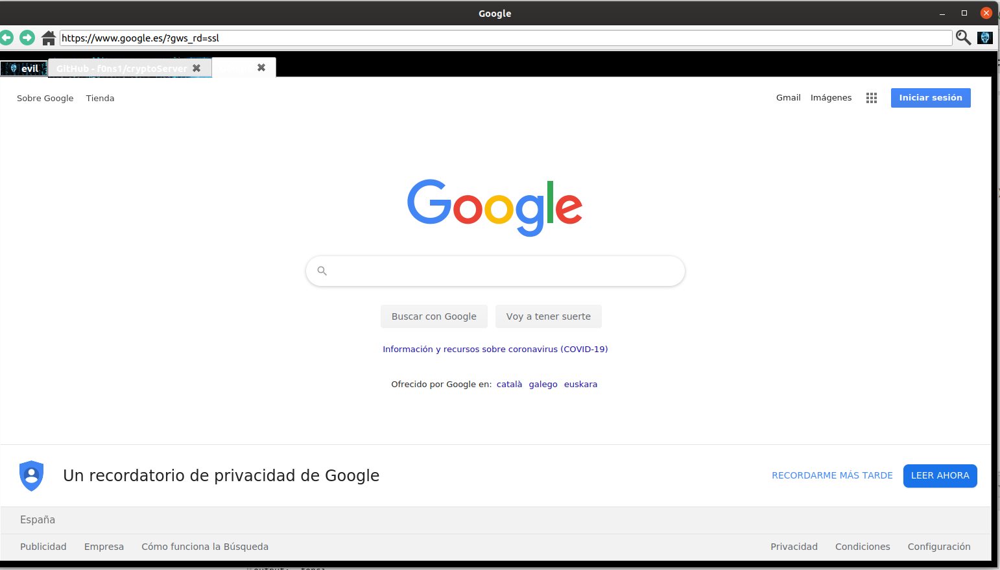

## Custom Pyhton Kit Tool 

Version 1.0

## New architecture

Proxy for evilBrowser Network WorldMap:

All Anonymos IP, changes everiy five minutes to an other location.

Centralize Architecture on Cloud server, that know every location of evilProcies and browsers:  

## Anonymous cloud proxy arround the world

	wget https://raw.githubusercontent.com/f0ns1/evilBrowser/master/Anonymous_cloud_server.sh

	- Atomation with a simple running script:
	
	
	./Anonymous_cloud_server.sh 

	....................SERVER .............................
	.. Linux f92f2a14c0c6 4.14.171-105.231.amzn1.x86_64 #1 SMP Thu Feb 27 23:49:15 UTC 2020 x86_64 x86_64 x86_64 GNU/Linux
	-- LOCAL NETWORK --  inet 172.17.0.3 netmask 255.255.0.0 broadcast 172.17.255.255

	 PUBLIC_IP = 3.134.109.182
	 PUBLIC_GEO_LOCATION =  {"status":"success","data":{"ipv4":"3.134.109.182","continent_name":"North America","country_name":"United States","subdivision_1_name":"Connecticut","subdivision_2_name":null,"city_name":"Fairfield","latitude":"41.14120","longitude":"-73.26370"}}
	---------------------------------------------------------
	Anonymous  location : 
	185.220.101.168
	GEO LOCATION =  {"status":"success","data":{"ipv4":"185.220.101.168","continent_name":"South America","country_name":"Colombia","subdivision_1_name":"Departamento de Risaralda","subdivision_2_name":null,"city_name":"El Rocio","latitude":"4.74500","longitude":"-75.65220"}}
	-----------------------------------------------------------

	-Node 2:
	
	  % Total    % Received % Xferd  Average Speed   Time    Time     Time  Current
                                 Dload  Upload   Total   Spent    Left  Speed
	100    16  100    16    0     0      1      0  0:00:16  0:00:11  0:00:05     3
	  % Total    % Received % Xferd  Average Speed   Time    Time     Time  Current
					 Dload  Upload   Total   Spent    Left  Speed
	100   256    0   256    0     0    185      0 --:--:--  0:00:01 --:--:--   185
	....................SERVER .............................
	.. Linux e55b8fee9468 4.14.171-105.231.amzn1.x86_64 #1 SMP Thu Feb 27 23:49:15 UTC 2020 x86_64 x86_64 x86_64 GNU/Linux
	-- LOCAL NETWORK --  inet 172.17.0.2 netmask 255.255.0.0 broadcast 172.17.255.255

	 PUBLIC_IP = 15.236.64.106
	 PUBLIC_GEO_LOCATION =  {"status":"success","data":{"ipv4":"15.236.64.106","continent_name":"North America","country_name":"United States","subdivision_1_name":"California","subdivision_2_name":null,"city_name":"Palo Alto","latitude":"37.37620","longitude":"-122.18260"}}
	---------------------------------------------------------
	 Anonymous  location : 
	185.220.101.230
	 GEO LOCATION =  {"status":"success","data":{"ipv4":"185.220.101.230","continent_name":"South America","country_name":"Colombia","subdivision_1_name":"Departamento de Risaralda","subdivision_2_name":null,"city_name":"El Rocio","latitude":"4.74500","longitude":"-75.65220"}}
	-----------------------------------------------------------
	Anonymous contaniner Succesfully started 

	- include custom Docker, with Proxy server and annonsurf navigation
	- allow navigate with OIT and anonymous with different tabs at the same time

Intra anonymous web usign tor proxies

custom browser with Qt and Gtk for unix version:

	- Multi tab
	- Basic navigation
	- Launch Shell terminal develop with GTK

Example output:

MultiTab navigation:

#Shell Terminal

Execute commands on Operative system

	- Terminal unix 
	- Test version

The idea it's make a new toolkit for hacking operations purposes:

	- inject js on request
	- develop plugins
	- develop custom Proxy
	- make connections with the following projects for cryptographic operations:

## Crypto Operations: 

	-https://github.com/f0ns1/cryptoServer

## Encrypted Conferences between browsers
	
	-https://github.com/f0ns1/XorEncryptionWebCamVideo-client/tree/Video_audio_TCP_encryption
	-https://github.com/f0ns1/XorEncryptionWebCamVideo/tree/Image_audio_encryption_TCP_IP

#Launch:

fonsi@fonsi-Lenovo-G580:~/crypto-framework/BrowserCustom$ python3 evilBrowser.py 
/home/fonsi/crypto-framework/BrowserCustom/evilTerminal.py:1: PyGIWarning: Gtk was imported without specifying a version first. Use gi.require_version('Gtk', '3.0') before import to ensure that the right version gets loaded

...
.

use:

	-python3
	-Qt
	-Gtk
	-Gdk
....
